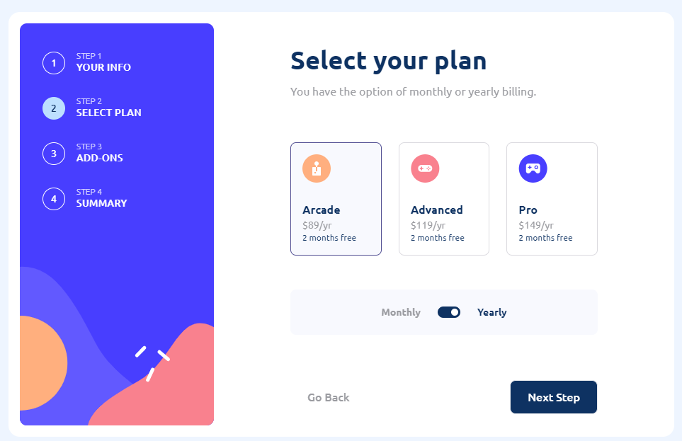
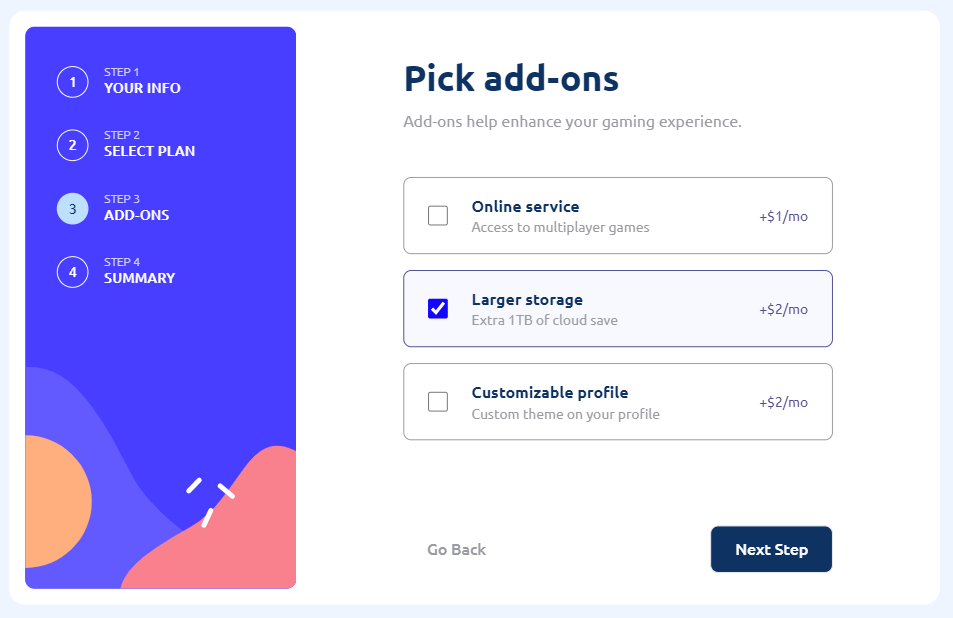
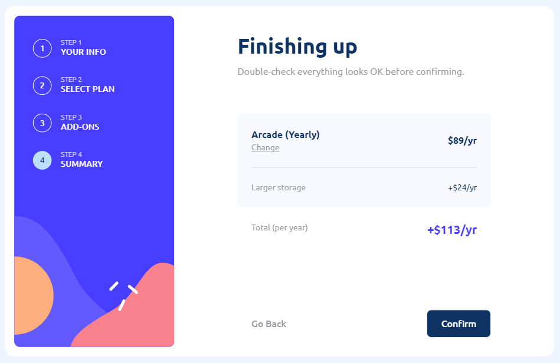
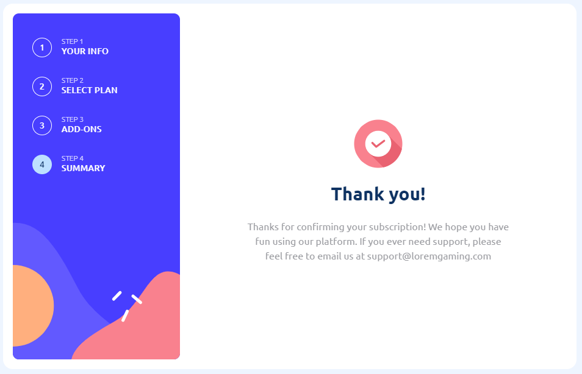
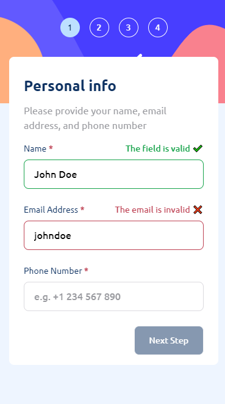
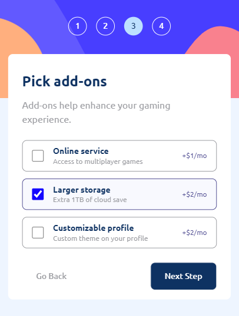
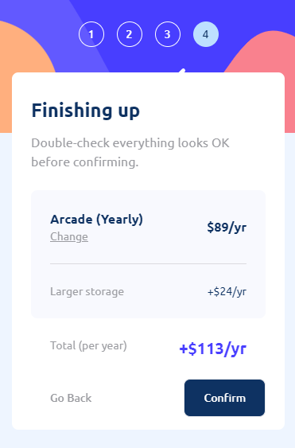

<h1 align="center">Multi-Step Form</h1>
<p align="center">
  <a href="https://github.com/arlagonix/multi-step-form"></a>
  <a href="#last-commit"></a>
  <a href="#license"></a>
</p>
<p align="center">
  Made with <code>HTML</code>, <code>CSS</code>, <code>TypeScript</code>, <code>ReactJS</code>, <code>TailwindCSS</code>
</p>
<p align="center">
  Bootstrapped with <code>Vite</code>
</p>

<p align="center">
  
</p>

<p align="center">
  
</p>

<p align="center">
  
</p>

<p align="center">
  
</p>

<p align="center">
  
</p>

<p align="center">
  
  
</p>

<p align="center">
  
  
</p>

<p align="center">
  
</p>

## ℹ️ About

This is a solution to the challenge "Multi-Step Form" from Frontend Mentor ([link](https://www.frontendmentor.io/challenges/multistep-form-YVAnSdqQBJ)).

The challenge is to build out this multi-step form and get it looking as close to the design as possible.

The users should be able to:

- Complete each step of the sequence
- See a summary of their selections on the final step and confirm their order
- View the optimal layout for the interface depending on their device's screen size
- See hover and focus states for all interactive elements on the page

I made my own Figma prototype: https://www.figma.com/file/6ecRJPjwajwLiwWVPLbdCh/Multi-step-form

## ⚙️ Tools

- **HTML5**
  - ReactJS
- **CSS**
  - TailwindCSS
- **TypeScript**
  - ReactJS
  - Framer Motion
  - React Final Form
  - Vitest
- **NodeJS**
- **Vite**
- **Github Pages**

## 🔨 Build project

<table>
  <tr>
    <th>Command</th>
    <th>Description</th>
  </tr>
  <tr>
    <td><code>npm&nbsp;start</code></td>
    <td>Starts a local web server with HMR (Hot Module Replacement) for development</td>
  </tr>
  <tr>
    <td><code>npm&nbsp;run&nbsp;build</code></td>
    <td>Builds the project, and outputs to the <code>./build</code> folder</td>
  </tr>
  <tr>
    <td><code>npm&nbsp;run&nbsp;preview</code></td>
    <td>Start a local web server that serves the built solution from <code>./build</code> for previewing</td>
  </tr>
  <tr>
    <td><code>npm&nbsp;run&nbsp;test:unit</code></td>
    <td>Runs unit tests</td>
  </tr>
  <tr>
    <td><code>npm&nbsp;run&nbsp;eslint</code></td>
    <td>Check that code conforms to Eslint</td>
  </tr>
  <tr>
    <td><code>npm&nbsp;run&nbsp;prettier:check</code></td>
    <td>Check that code conforms to Prettier style</td>
  </tr>
  <tr>
    <td><code>npm&nbsp;run&nbsp;prettier:format</code></td>
    <td>Format code in src accoring to Prettier</td>
  </tr>
</table>

## 📁 File Structure

```Markdown
├── 📁 src - Source files needed for application development
│   ├── 📁 assets - Static assets: images, icons, favicons
│   ├── 📁 components - React components
│   ├── 📁 pages - React page components
│   ├── 📁 utils - Utility functions
│   ├── 📄 index.html - Main html file
│   ├── 📄 App.tsx - App React component
│   ├── 📄 index.tsx - Entry point for the module bundler
│   ├── 📄 index.css - Tailwind declarations mainly
│   └── 📄 vite-end.d.ts - Some Typescript stuff for Vite
│
├── 📁 .github
|   └── 📁 workflows
|       └── 📄 main.yaml - CI/CD instructions for Github Actions
|
├── 📁 docs - Additional information, documentation 
│   └── 📁 results - Screenshots of how the application works after being fully developed
|
├── 📄 LICENSE - MIT License. Basically you can do whatever you want with the code
├── 📄 tsconfig.json - TypeScript configuration file
├── 📄 tsconfig.node.json - TypeScript configuration file for Vite
├── 📄 vite.config.js - Vite configuration file
├── 📄 tailwind.config.cjs - TailwindCSS configuration file
├── 📄 postcss.config.cjs - PostCSS configuration file
├── 📄 .eslintrc.json - ESLint configuration file
├── 📄 package-lock.json - Keeps track of the exact version of every package that is installed
├── 📄 package.json - Various metadata relevant to the project, scripts, dependencies
└── 📄 README.md
```

## 📦 NPM Packages worth mentioning

- `tailwindcss` - For CSS
- `vitest` - Unit testing
- `framer-motion` - Adds nice looking animations
- `classnames` - Conditionally define sets of CSS classes
- `react-final-form`, `final-form` - Form validation

## 💡 Details

Not that difficult at all. But I am not gonna use TailwindCSS in any upcoming projects! Styled Components are so much better! And the code looks much, much cleaner!

Features

- Nice animations
- Animated counters for final prices
- Unit tests
- Form validation with React Final Form

## 🔗 Useful resources

- [How to deploy a react app on GH Pages](https://www.freecodecamp.org/news/deploy-a-react-app-to-github-pages/) - to put shortly, just use HashRouter in the application
- [Github Actions - Введение в CI/CD](https://www.youtube.com/watch?v=e0A2hDObLmg) - Introduction to CI/CD with Github Actions, in Russian. Helped me to get understand the basics
- [Framer Motion](https://www.framer.com/motion/) - Official framer-motion docs

## 👤 Author

- Frontend Mentor - [@GrbnvAlex](https://www.frontendmentor.io/profile/GrbnvAlex)
- Telegram - [@Arlagonix](https://t.me/Arlagonix)
- Github - [@arlagonix](https://github.com/arlagonix)
